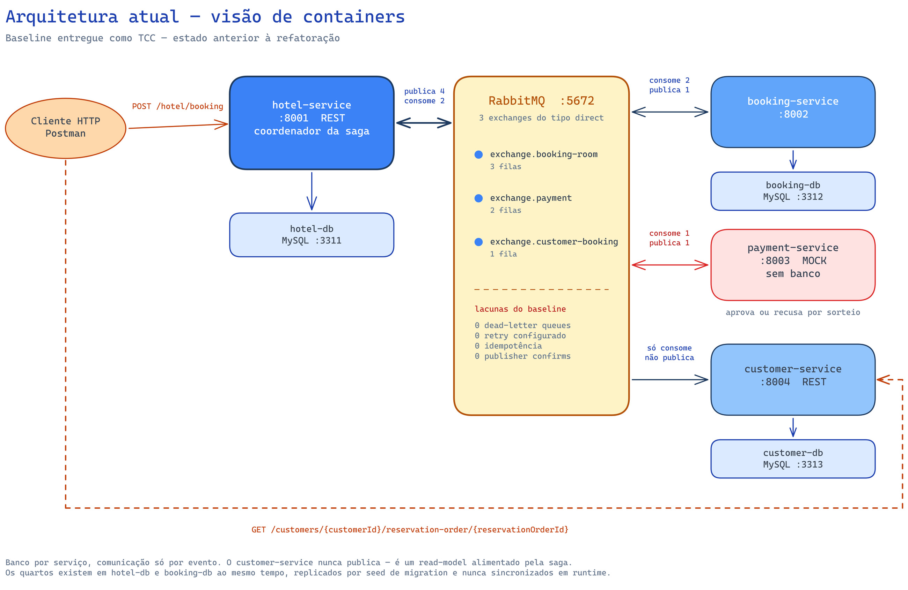
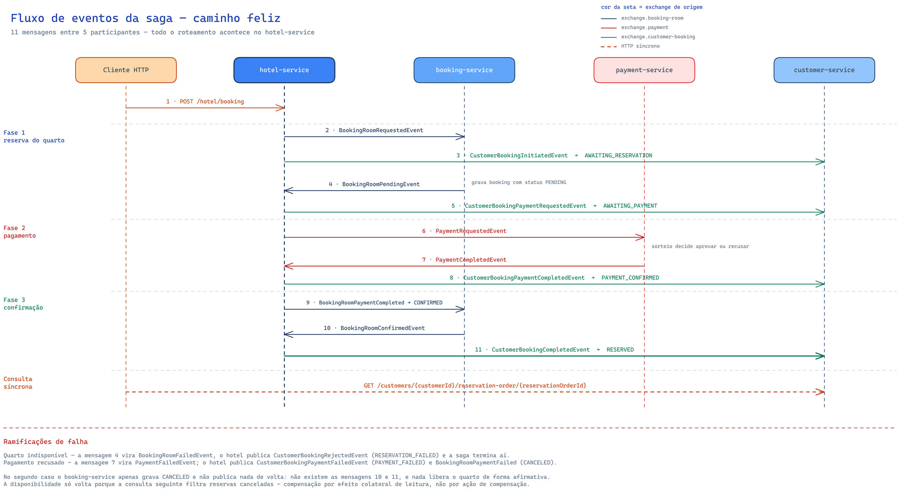
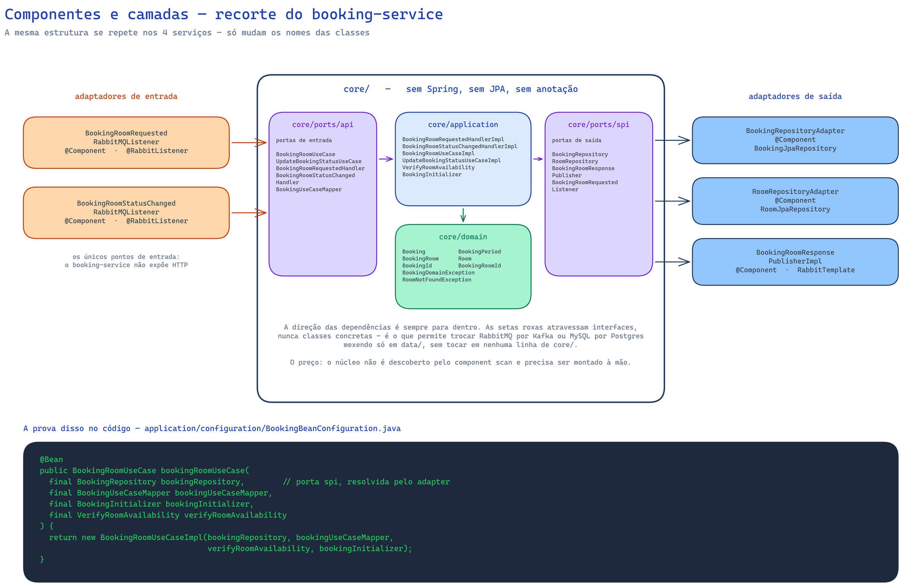
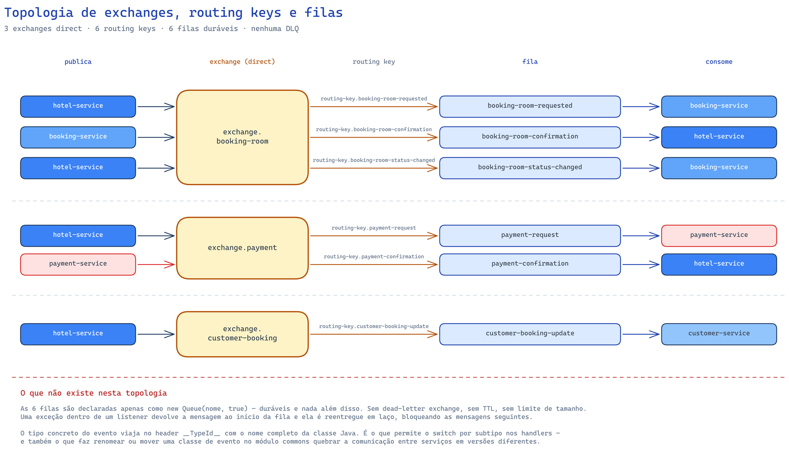
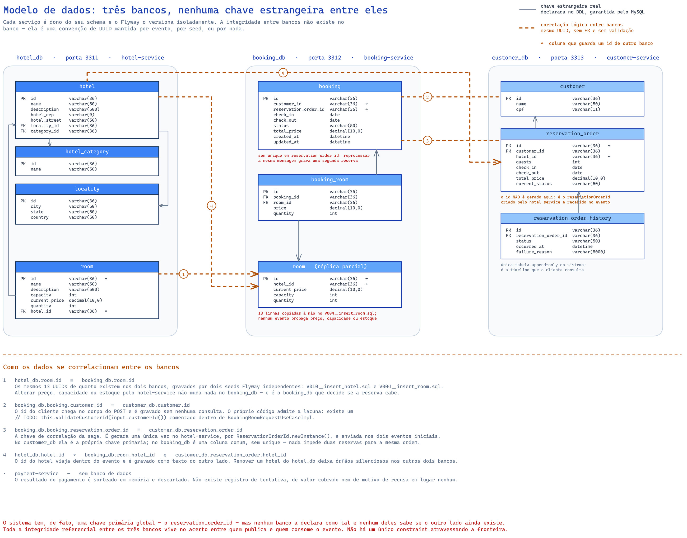

# Hotel Booking System — Enhanced

Sistema de reserva de quartos de hotel distribuído em quatro microsserviços, orquestrado por uma saga
sobre RabbitMQ.

## Sobre este repositório

Este projeto nasceu como **Trabalho de Conclusão de Curso do curso de Engenharia da Computação do IFMT**,
desenvolvido entre junho e dezembro de 2023. O repositório original continua publicado, intacto, em
[**da0hn/hotel-booking-system**](https://github.com/da0hn/hotel-booking-system) — 178 commits, do
`Initial commit` (22/06/2023) ao `docs: update readme deployment instructions` (10/12/2023).

Este repositório (`-enhanced`) é uma cópia desse histórico com um propósito diferente: **revisitar o
projeto com o conhecimento que eu não tinha na época e refatorá-lo de forma incremental.** O código
original foi escrito sem assistência de agentes e sem a experiência que veio depois — o que o torna um
material de estudo honesto sobre decisões arquiteturais que pareciam certas e não eram.

O commit `b27facb` marca a **linha de base congelada**: tudo abaixo dele é o TCC como foi entregue.
Tudo acima é refatoração.

As pendências levantadas na revisão inicial estão registradas como
[**issues**](https://github.com/da0hn/hotel-booking-system-enhanced/issues), cada uma com critérios de
aceite, nota técnica e cenários de teste. São 14 no momento, cobrindo desde precisão decimal em colunas
monetárias até a ausência de compensação na saga.

---

## Sumário

* [1. Arquitetura da linha de base](#1-arquitetura-da-linha-de-base)
  * [1.1. Visão de containers](#11-visão-de-containers)
  * [1.2. A saga de reserva, evento a evento](#12-a-saga-de-reserva-evento-a-evento)
  * [1.3. Componentes e camadas (arquitetura hexagonal)](#13-componentes-e-camadas-arquitetura-hexagonal)
  * [1.4. Topologia de exchanges, routing keys e filas](#14-topologia-de-exchanges-routing-keys-e-filas)
  * [1.5. Modelo de dados e correlação entre os bancos](#15-modelo-de-dados-e-correlação-entre-os-bancos)
* [2. Introdução](#2-introdução)
  * [2.1. Tecnologias](#21-tecnologias)
  * [2.2. Aplicações de suporte (infraestrutura)](#22-aplicações-de-suporte-infraestrutura)
  * [2.3. Tópicos e Filas](#23-tópicos-e-filas)
  * [2.4. Microsserviços](#24-microsserviços)
* [3. Setup](#3-setup)
  * [3.1. Pré Requisitos](#31-pré-requisitos)
  * [3.2. Instalação](#32-instalação)

---

# 1. Arquitetura da linha de base

Os quatro diagramas abaixo mapeiam o sistema **como ele está no commit `b27facb`**, antes de qualquer
refatoração. Eles existem para servir de **termo de comparação**: ao final do trabalho, o mesmo conjunto
de vistas será redesenhado sobre a arquitetura resultante, e a diferença entre os dois conjuntos é o que
o projeto de refatoração de fato entregou.

Os fontes editáveis (`.excalidraw`) ficam em [`docs/diagrams/`](docs/diagrams) — abra em
[excalidraw.com](https://excalidraw.com) para alterá-los.

## 1.1. Visão de containers

Quem fala com quem, por qual protocolo, e quem é dono de qual banco.



Três pontos que o desenho torna evidentes:

- **O `hotel-service` é o centro de tudo.** Ele é o único ponto de entrada da reserva e o único serviço
  que decide o passo seguinte da saga. Os demais reagem a mensagens e devolvem o resultado para ele.
- **O `payment-service` é um mock** que sorteia aprovação por saldo fictício, e não possui banco próprio
  nem API HTTP.
- **O `customer-service` só consome.** Ele mantém a projeção de leitura do agendamento do cliente e nunca
  publica nada de volta na saga.

## 1.2. A saga de reserva, evento a evento

O caminho feliz completo, das doze mensagens trocadas entre o `POST /hotel/booking` e a confirmação final,
com as ramificações de falha no rodapé.



A saga é **coreografada na aparência e orquestrada na prática**: embora todos os serviços se comuniquem
apenas por eventos, todo o roteamento vive em dois `switch` sobre hierarquias `sealed` dentro do
`hotel-service`. Nenhum outro serviço decide o que acontece depois.

O rodapé do diagrama documenta a lacuna mais séria do desenho original: **não existe ação de compensação**.
Quando o pagamento falha, o `booking-service` apenas grava `CANCELED` e a disponibilidade do quarto só
"volta" porque a consulta seguinte filtra reservas canceladas — compensação por efeito colateral de
leitura, não por ato explícito.

## 1.3. Componentes e camadas (arquitetura hexagonal)

Cada serviço segue ports & adapters em módulos Maven separados. O diagrama usa o `booking-service` como
recorte, mas o padrão se repete nos quatro.



O ponto central é que **o módulo `core/` não conhece Spring**. Não há `@Service`, `@Component` ou
`@Autowired` dentro dele: os casos de uso são POJOs com construtor explícito, e a instanciação acontece
em classes `*BeanConfiguration` que vivem no módulo `application/`. O preço é a fiação manual; o ganho é
um domínio testável sem contexto de aplicação.

## 1.4. Topologia de exchanges, routing keys e filas

As três exchanges `direct`, as seis routing keys e as seis filas, com quem publica e quem consome cada uma.



As filas são declaradas apenas como `new Queue(nome, true)` — duráveis e nada além disso. **Sem
dead-letter exchange, sem TTL, sem retry com backoff**: uma exceção dentro de um listener devolve a
mensagem ao início da fila e ela é reentregue em laço, bloqueando as mensagens seguintes.

O contrato de serialização também merece atenção: o tipo concreto do evento viaja no header `__TypeId__`
com o **nome completo da classe Java**. É o que permite o `switch` por subtipo nos handlers — e também
o que faz renomear ou mover uma classe de evento no módulo `commons` quebrar a comunicação entre serviços
em versões diferentes.

## 1.5. Modelo de dados e correlação entre os bancos

As dez tabelas dos três bancos, com o detalhe que mais importa em um sistema distribuído: **quais colunas
guardam identificadores que pertencem a outro banco**, e o que sustenta essa ligação.



Linha sólida é chave estrangeira de verdade, declarada no DDL e garantida pelo MySQL — e todas elas ficam
**dentro** de um único banco. Linha tracejada laranja é correlação lógica: o mesmo UUID gravado dos dois
lados, sem `FOREIGN KEY`, sem validação e sem ninguém verificando se o outro lado ainda existe.

São quatro travessias, e cada uma se sustenta em algo diferente:

| # | Correlação | O que a mantém |
|:-:|---|---|
| 1 | `hotel_db.room.id` ≡ `booking_db.room.id` | Dois seeds Flyway independentes com os mesmos 13 UUIDs. Nada propaga alterações |
| 2 | `booking_db.booking.customer_id` ≡ `customer_db.customer.id` | Nada. O id vem no corpo do `POST` e é gravado sem consulta |
| 3 | `booking_db.booking.reservation_order_id` ≡ `customer_db.reservation_order.id` | O evento. É a chave de correlação da saga, gerada uma vez no `hotel-service` |
| 4 | `hotel_db.hotel.id` → `hotel_id` nos outros dois bancos | O evento, como texto. Remover um hotel deixa órfãos silenciosos |

O `reservation_order_id` é, na prática, a chave primária global do sistema — mas **nenhum banco a declara
como tal**. No `customer_db` ela é a PK de `reservation_order`; no `booking_db` é uma coluna comum, sem
índice único, o que significa que reprocessar a mesma mensagem grava uma segunda reserva para a mesma
ordem. O `payment-service` não aparece no diagrama porque não tem banco: o resultado do pagamento é
sorteado em memória e descartado, sem registro de tentativa, valor cobrado ou motivo de recusa.

Vale notar também que todas as colunas monetárias são `decimal` sem precisão declarada, o que o MySQL
resolve como `DECIMAL(10,0)` — centavos são arredondados na gravação.

---

# 2. Introdução

Este repositório possui um conjunto de microsserviços com o objetivo de representar o fluxo simplificado de um sistema de reserva de
quartos de hotel como, por exemplo, o `booking.com`.

Para isso a aplicação, foi dividida em 4 microsserviços e um módulo compartilhado entre esses serviços afim de evitar duplicação de
código.

----------------------------------------------------------------

## 2.1. Tecnologias

| Tecnologia  | Versão                |
|-------------|-----------------------|
| Docker      | 24.0.5, build ced0996 |
| Java        | OpenJDK 25            |
| Maven       | 3.9.11                |
| Spring Boot | 4.1.1                 |
| MySQL       | 8.0.33                |
| RabbitMQ    | 3-management          |

## 2.2. Aplicações de suporte (infraestrutura)

As credenciais de acesso e portas podem ser alteradas através das variáveis de ambiente definidas no arquivo `.env` e nas variáveis do arquivo
`common.yml` e `services.yml`.

|   Tipo   |       Porta        |          Serviço           | Usuário |  Senha   | 
|:--------:|:------------------:|:--------------------------:|:-------:|:--------:|
|  MySQL   |        3311        |          hotel-db          |  user   | password |
|  MySQL   |        3312        |         booking-db         |  user   | password |
|  MySQL   |        3313        |        customer-db         |  user   | password |
| RabbitMQ | 5672, 25676, 15672 | hotel-booking-system-queue |  root   |   root   |

## 2.3. Tópicos e filas

|         Exchange          |               Routing Key               |             Fila              |
|:-------------------------:|:---------------------------------------:|:-----------------------------:|
|   exchange.booking-room   |   routing-key.booking-room-requested    |   `booking-room-requested`    |
|   exchange.booking-room   |  routing-key.booking-room-confirmation  |  `booking-room-confirmation`  |
|   exchange.booking-room   | routing-key.booking-room-status-changed | `booking-room-status-changed` |
|     exchange.payment      |       routing-key.payment-request       |       `payment-request`       |
|     exchange.payment      |    routing-key.payment-confirmation     |    `payment-confirmation`     |
| exchange.customer-booking |   routing-key.customer-booking-update   |   `customer-booking-update`   |

## 2.4. Microsserviços

|  Microsserviço   | Porta Padrão |            API URL            |
|:----------------:|:------------:|:-----------------------------:|
|  Hotel Service   |     8001     |  `${baseUrl}/hotel-service`   |
| Booking Service  |     8002     | `${baseUrl}/booking-service`  |
| Payment Service  |     8003     |               -               |
| Customer Service |     8004     | `${baseUrl}/customer-service` |

### 2.4.1. Hotel Service

Este serviço possui os endpoints para executar ações como a reserva de um quarto de hotel, criação de um hotel e
consulta dos quartos de hotel disponíveis. Ainda, se comunica com os outros três serviços através das filas do `RabbitMQ`.

----------------------------------------------------------------

### 2.4.2. Booking Service

Este serviço recebe mensagens vindas do `Hotel` e tem como responsabilidade gerenciar as reservas feitas pelo cliente armazenando as datas
da reserva relacionadas ao quarto de hotel.

----------------------------------------------------------------

### 2.4.3. Payment Service

Este serviço atua como um sistema de pagamento fake simulando a tentativa de pagamento e verificação de saldo notificando o serviço de `Hotel`
sobre o sucesso ou falha do pagamento através do `RabbitMQ`.

----------------------------------------------------------------

### 2.4.4. Customer Service

Este serviço contém informações sobre os agendamentos do cliente (`customer`) sendo atualizado a cada alteração no fluxo da reserva do quarto e
expondo endpoints para consultar a situação atual do agendamento do cliente.

# 3. Setup

Certifique-se de executar os passos abaixo na ordem correta e ter as ferramentas apresentadas instaladas em seu sistema antes de prosseguir com a
execução a da aplicação.

## 3.1. Pré Requisitos

* [Docker](https://docs.docker.com/desktop/)
  * Para verificar se o docker foi instalado corretamente execute o comando `docker --version`
* [Docker Compose](https://docs.docker.com/compose/install/)
  * Para verificar se o docker-compose foi instalado corretamente execute o comando `docker-compose --version`
* [Java](https://jdk.java.net/25/)
  * Para verificar se o java foi instalado corretamente execute o comando `java --version`
  * A instalação do `jdk` na `versão 25` só será necessária caso você deseje executar a aplicação localmente sem utilizar o `docker`

## 3.2. Instalação

* Construa os volumes correspondentes para armazenamento de dados dos bancos de dados utilizando o comando:

```sh
docker volume create --name=hotel-db-volume --driver local --opt type=none --opt device=D:/opt/hotel-booking-system/hotel-db/mysql --opt o=bind
docker volume create --name=booking-db-volume --driver local --opt type=none --opt device=D:/opt/hotel-booking-system/booking-db/mysql --opt o=bind
docker volume create --name=customer-db-volume --driver local --opt type=none --opt device=D:/opt/hotel-booking-system/customer-db/mysql --opt o=bind
```

* Após isso é possível iniciar todos os serviços e aplicações auxiliares como banco de dados e filas executando o comando abaixo dentro da pasta
  `docker`.
* O parâmetro `--build` irá construir as imagens dos microsserviços antes de iniciar os containeres.

* A especificação dessas imagens está definida em um único `Dockerfile` na raiz do projeto, parametrizado pelo argumento `MODULE` — o
  `services.yml` passa o nome do serviço em `build.args`. As imagens publicadas no GHCR pela action `build` saem exatamente do mesmo arquivo.

```sh
docker-compose -p hotel-booking-system -f common.yml -f services.yml up -d
```

* Para derrubar os contêineres execute o comando abaixo:

```sh
docker-compose -p hotel-booking-system down
```

* Para apagar todos os volumes locais de dados execute o comando abaixo:

```sh
docker volume rm $(docker volume ls -q)
```

* Para realizar os testes é possível utilizar o postman como cliente http e importar a collection localizada em `${projeto}/postman`.
